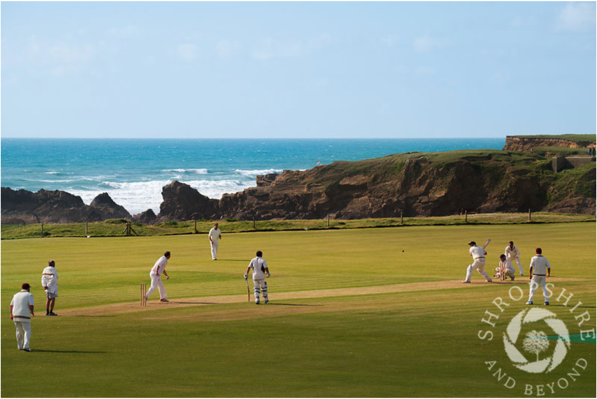
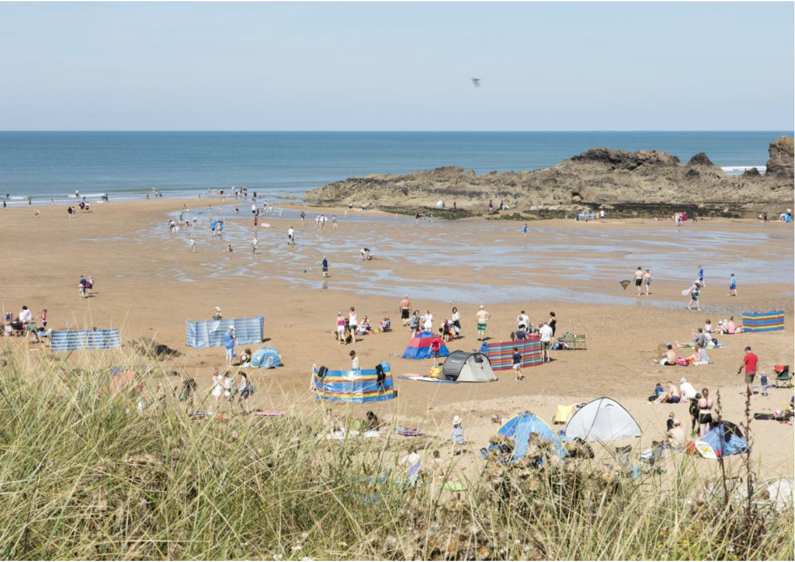
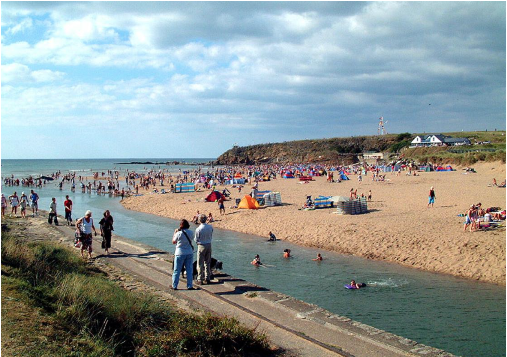
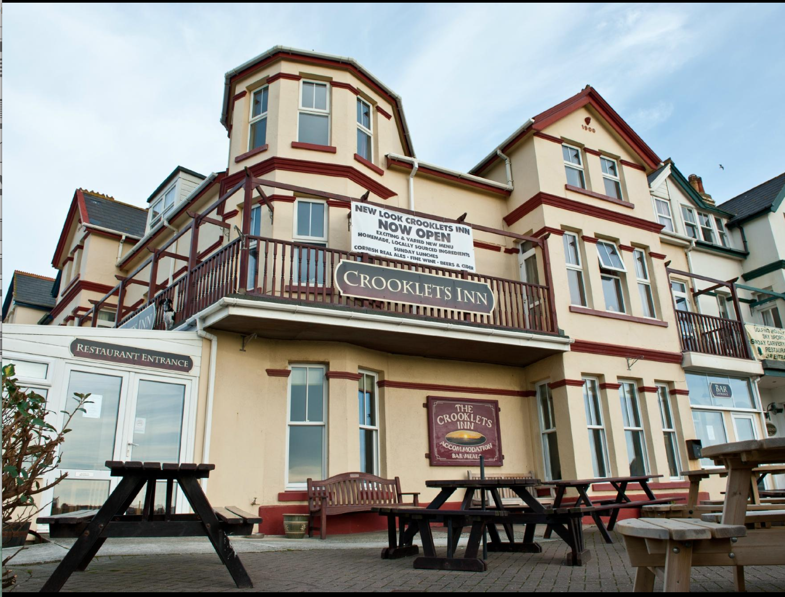

```{r setup, include=FALSE}
knitr::opts_chunk$set(echo = FALSE)
library(ggmap)
library(tidyverse)
library(ggplot2)
geocode('town of Bude')
map1=get_map(location = 'Bude,UK',maptype = 'roadmap',zoom = 14)
map2=get_map(location = 'Bude,UK',maptype = 'watercolor',zoom = 14)
beach1<-geocode('Crooklets Beach')
Beach2<-geocode('Summerleaze Beach')
q<-route('Bude North Cornwall Cricket Club','Bar35 Bude',structure = "route")
map3<-ggmap(map1)+geom_path(
  aes(lon,lat), colour = "red", size = 1.5,
  data = q, lineend = "round"
)+geom_point(aes(x=-4.553962,y=50.83587),size=3,color='red')+geom_point(aes(x=-4.551349,y=50.83054),size=3,color='red')
map4<-ggmap(map2)+geom_point(aes(x=-4.553962,y=50.83587),size=3,color='red')+geom_point(aes(x=-4.551349,y=50.83054),size=3,color='red')
bar35<-geocode('Belle Vue Ln, Bude EX23 8BR, UK')
```

```{r include=TRUE}
map3
```
##Added information 

###another bar 
```{r}
map5<-ggmap(map1)+geom_path(
  aes(lon,lat), colour = "red", size = 1.5,
  data = q, lineend = "round"
)+geom_point(aes(x=-4.553962,y=50.83587),size=3,color='red')+geom_point(aes(x=-4.551349,y=50.83054),size=3,color='red') +  geom_point(aes(x = -4.551132, y = 50.83597),color = "yellow", size = 3)
map5
```


###Images 








